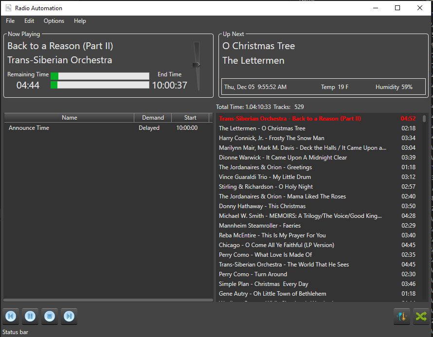

[](https://github.com/jeffu231/Radio-Automation/issues)


# Radio-Automation

Radio Automation is a purpose built audio player designed to be a off hours music player for my animated light display during the holidays. 



## Features

### Player

Support for playing most media types supported on Windows. There is a simple playlist that utilizes the track ID3 info. There is a basic function to shuffle tracks on each trip through the playlist.

### Playlists

Playlists can be populated from selecting specific tracks, M3U playlists, Zara playlist, or an internet stream. 

### Scheduler

Support for basic scheduling in a cron like format to schedule things like bumpers. It has support for Time and Temperature audio files in the form that Zara utilized. Temp is sourced from Wunderground via their API. 
Items like play, stop, time, temp are supported in an immediate or delayed fashion. If delayed, it will play between tracks. Immediate will interupt. When using internet streams you will generally want immediate events, since there is no logical break between tracks.
The left pane in the main display shows upcoming events.

### Zara Time / Temp Audio Files

The Zara style Time / Temp files are stored in a folder in a structure like below:
```
PSA_TimeTemp
   |
   +-- Time
   |     |
   |     +-- HRS00.mp3
   |     +-- HRS00_O.mp3
   |     +-- HRS01.mp3
   |     +-- HRS01_O.mp3 
   |     +-- HRS02.mp3
   |     +-- HRS02_O.mp3
   |     +-- ...
   |     +-- MIN00.mp3
   |     +-- MIN01.mp3
   |     +-- MIN02.mp3
   |     +-- ...
   |
   +-- Temperature
		 |
		 +-- TMP000.mp3
		 +-- TMP001.mp3
		 +-- TMP002.mp3
		 +-- ...
		 +-- TMP065.mp3
```

You can find more information with some internet searches on the Zara Radio software time/temp audio file structure.

### MQTT

Support for triggering the same scheduled type events from an MQTT topic. In the Preferences you can set the MQTT broker info and the topic to listen on.

### Audio Output

Support for choosing the audio output device on the system. This is configured in the Preferences.

### UI

The simple UI has sections to display basic info. The now playing section shows the current playing track info, remaining time, end time audio level meter and a volume control. The up next section shows the next track scheduled to play, the current time and weather info. 
The event section shows upcoming events from the scheduler and if they are immediate or delayed. The playlist section shows the entire playlist and highlights which track is currently playing. You can right click any track in the playlist amd select Remove to remove it.

### Weather

Support for getting current temperature / humidity from Wunderground via their API. You will need to have an API key for Wunderground and the station id for the location you want to use. This information can then be used for automated temperature bumpers.

### Support

While there is no formal support for this software, you can open an issue on GitHub if you find a bug or have a question.

#### License

Software is released under the GPL v3 and is free to use under those terms.

